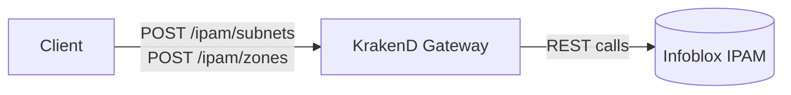

# IPAM Gateway

This KrakenD configuration proxies Infoblox and exposes its IPAM API under the `/ipam` path. Clients interact with the gateway instead of contacting Infoblox directly.


## Architecture



## Endpoints

- `POST http://<gateway>/ipam/subnets` – create subnets
- `POST http://<gateway>/ipam/zones` – create zones

Requests are validated against JSON Schemas found in `schemas/`.

An OpenAPI specification describing the gateway is available in `openapi.yaml`.

## Configuration

Set the following environment variables before starting KrakenD:

- `KRAKEND_PORT` – port where KrakenD listens
- `INFOBLOX_HOST` – Infoblox host (e.g., `infoblox.example.com`)
- `INFOBLOX_USER` – Infoblox username
- `INFOBLOX_PASS` – Infoblox password

Run the gateway with:

```sh
krakend run -c krakend.yaml
```

Once running, clients can call `http://<gateway>/ipam/*` to access the IPAM API.
